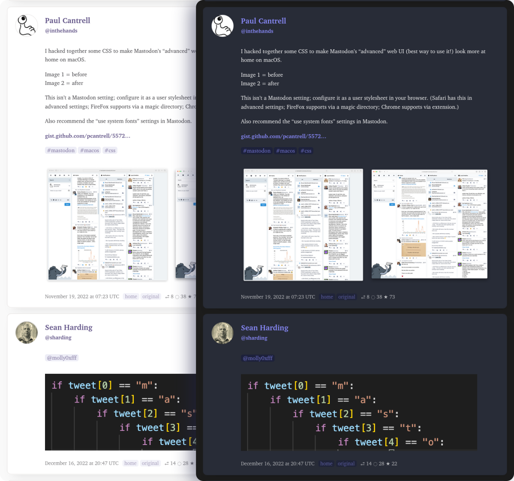

A fork of [hodgesmr/mastodon_digest](https://github.com/hodgesmr/mastodon_digest) that

- runs on github actions
- renders mastodon posts without iframes
- in a clean and responsive style



[**see live** 🎉](https://mauforonda.github.io/mastodon_digest/)

---

> **Mastodon Digest** scans posts you haven't yet seen in your timeline, finds the most popular ones and shows them to you in a pretty page. 

## To run your own

1. Fork this repository
2. Create repository secrets (`Settings` → `Secrets/Actions` → `New repository secrets`) for:
  - `MASTODON_BASE_URL`: the url of your instance, like `https://mastodon.social`
  - `MASTODON_USERNAME`: your user name, like `Gargron`
  - `MASTODON_TOKEN`: a token you request in your instance settings under `Preferences` → `Development`
3. Adjust the [github workflow](.github/workflows/update.yml) however you want
  - edit `cron` to define how often you want the digest to run
  - edit the command `python run.py -n 12 -s SimpleWeighted -t lax` with your own preferences for:
```
  -n {1,2,3,4,5,6,7,8,9,10,11,12,13,14,15,16,17,18,19,20,21,22,23,24}
                        The number of hours to consider (default: 12)
  -s {ExtendedSimple,ExtendedSimpleWeighted,Simple,SimpleWeighted}
                        Which post scoring criteria to use. Simple scorers take a geometric
                        mean of boosts and favs. Extended scorers include reply counts in
                        the geometric mean. Weighted scorers multiply the score by an
                        inverse sqaure root of the author's followers, to reduce the
                        influence of large accounts. (default: SimpleWeighted)
  -t {lax,normal,strict}
                        Which post threshold criteria to use. lax = 90th percentile, normal
                        = 95th percentile, strict = 98th percentile (default: normal)
```
4. Enable github actions under `Settings` → `Actions/General`,  run the action from the `Actions` tab and when it succeeds publish your digest by going to `Settings` → `Pages` and selecting to deploy from the `root` of the `gh-pages` branch. 